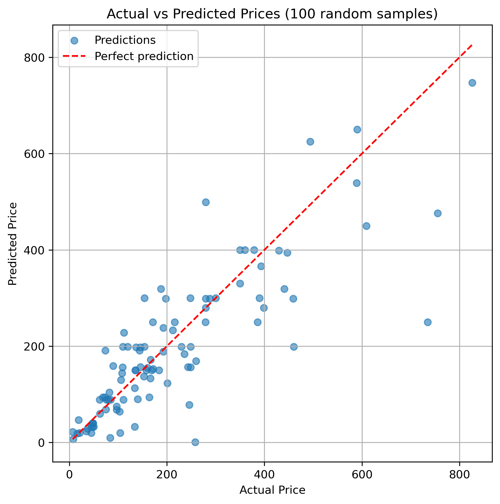

# openai-finetune-price-prediction-llm

Fine-tuning OpenAI LLMs to predict product prices from text descriptions.  
Includes **data preparation**, **fine-tuning**, **cost estimation**, **monitoring**, **inference**, and **evaluation**.

---

## 📊 Example Results

Scatter plot comparing **actual vs predicted prices** (100 random samples):  



- The red dashed line shows **perfect predictions**.  
- Most points are close, though expensive products are often under-predicted.  

---

## 🔧 Setup

1. **Clone the repo**

   ```bash
   git clone https://github.com/<your-username>/openai-finetune-price-prediction-llm.git
   cd openai-finetune-price-prediction-llm
   ```

2. **Create a virtual environment**

   ```bash
   python3 -m venv venv
   source venv/bin/activate   # macOS/Linux
   venv\Scripts\activate      # Windows
   ```

3. **Install dependencies**

   ```bash
   pip install -r requirements.txt
   ```

4. **Set your OpenAI API key**

   ```bash
   export OPENAI_API_KEY="your_api_key_here"   # macOS/Linux
   setx OPENAI_API_KEY "your_api_key_here"     # Windows PowerShell
   ```

---

## ⚙️ Training Configuration

The training configuration is in **`config.py`**.  

```python
# ----------------------------
# Training configuration
# ----------------------------

# Base model for fine-tuning
model = "gpt-3.5-turbo-1106"

# Number of training epochs
epochs = 3

# Random seed for reproducibility
seed = 42

# Limit training records (useful for experiments/cost saving)
num_train_records = 400000   # total rows in training dataset

# System message for training
system_message = (
    "You are a helpful assistant that predicts product prices. "
    "Read the product description and estimate the price to the nearest dollar. "
    "Format your response exactly as: PRICE: <number>."
)

from openai import OpenAI
openai_client = OpenAI()
```

### 🔹 Example changes
- Train with fewer samples (for cost-saving):
  ```python
  num_train_records = 50000
  ```
- Increase epochs:
  ```python
  epochs = 5
  ```
- Switch model:
  ```python
  model = "gpt-4o-mini"
  ```

---

## 📂 Workflow

### 1. Prepare Data
Convert dataset into JSONL format (`train.jsonl`, `validation.jsonl`, `test.jsonl`):

```bash
python prepare_data.py
```

### 2. Estimate Cost
Check how many tokens are in your training/validation sets and estimate cost:

```bash
python cost_estimation.py
```

Example output:
```
Train tokens   : 92,471
Validation     : 41,672
Epochs         : 3
Model          : gpt-3.5-turbo-1106
Total billed   : 277,413
💰 Estimated cost: $2.40
```

### 3. Start Fine-Tuning
Uploads `train.jsonl` and `validation.jsonl` and launches a fine-tune job.  
The job ID is saved to `last_job_id.txt`.

```bash
python start_finetune.py
```

### 4. Monitor Training
Check progress:
```bash
python monitor_finetune.py
```

Live updates:
```bash
python monitor_finetune_live.py
```

Quick status:
```bash
python checkJobStatus.py
```

### 5. Run Inference
Once fine-tuning finishes, run predictions:

```bash
python inference.py
```

Or test with a custom description:

```python
from openai import OpenAI
client = OpenAI()

model_name = "ft:gpt-3.5-turbo-1106:your-org::your-id"

prompt = "How much does this cost to the nearest dollar? Samsung 32-inch LED Monitor, Full HD, HDMI & VGA ports, Slim Design"

response = client.chat.completions.create(
    model=model_name,
    messages=[
        {"role": "system", "content": "You estimate prices of items. Reply only with the price, no explanation."},
        {"role": "user", "content": prompt}
    ]
)

print("Prediction:", response.choices[0].message.content)
```

Expected:
```
PRICE: 250
```

### 6. Evaluate
Evaluate on 100 random test samples:

```bash
python evaluate_random.py
```

Prints **MAE, RMSE**, and generates the scatter plot shown above.

---

## 📑 Sample Training Record

Each record in the training/validation JSONL follows the **ChatML-style conversation format**.  
Here’s one full example (also available in [`sample.jsonl`](sample.jsonl)):

```json
{
  "messages": [
    {
      "role": "system",
      "content": "You are a helpful assistant that predicts product prices. Read the product description and estimate the price to the nearest whole dollar. Format your response exactly as: PRICE: <number>."
    },
    {
      "role": "user",
      "content": "How much does this cost to the nearest dollar? Delphi FG0166 Fuel Pump Module Delphi brings 80 years of OE Heritage into each Delphi pump, ensuring quality and fitment for each Delphi part. Part is validated, tested and matched to the right vehicle application Delphi brings 80 years of OE Heritage into each Delphi assembly, ensuring quality and fitment for each Delphi part Always be sure to check and clean fuel tank to avoid unnecessary returns Rigorous OE-testing ensures the pump can withstand extreme temperatures Brand Delphi, Fit Type Vehicle Specific Fit, Dimensions LxWxH 19.7 x 7.7 x 5.1 inches, Weight 2.2 Pounds, Auto Part Position Unknown, Operation Mode Mechanical, Manufacturer Delphi, Model FUEL PUMP, Dimensions 19.7"
    },
    {
      "role": "assistant",
      "content": "PRICE: 227"
    }
  ]
}
```

---

## 📊 Project Files

- `config.py` → Training config (model, epochs, system message).  
- `dataUtil.py` → Data utilities (cleaning, JSONL export, token counting).  
- `prepare_data.py` → Prepares JSONL dataset + saves train/val/test.  
- `cost_estimation.py` → Estimates training cost from dataset tokens.  
- `start_finetune.py` → Uploads data, starts fine-tuning job.  
- `monitor_finetune.py` → Static monitoring of training loss.  
- `monitor_finetune_live.py` → Live monitoring with plots.  
- `checkJobStatus.py` → Quick fine-tune job status.  
- `inference.py` → Run inference with fine-tuned model.  
- `evaluate_random.py` → Evaluate performance on test set.  
- `sample.jsonl` → A small subset of records with full training format.  

---

## ⚠️ Notes

- **Only `train.jsonl` tokens are billed.**  
- `validation.jsonl` → used for validation loss (**not billed**).  
- `test.jsonl` → for offline evaluation only.  

---
